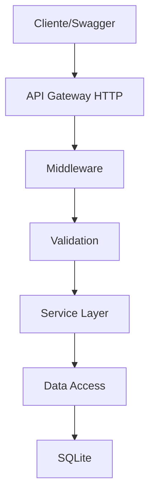
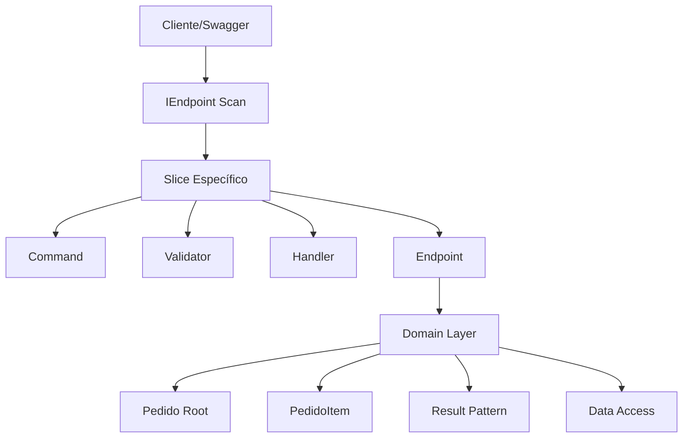
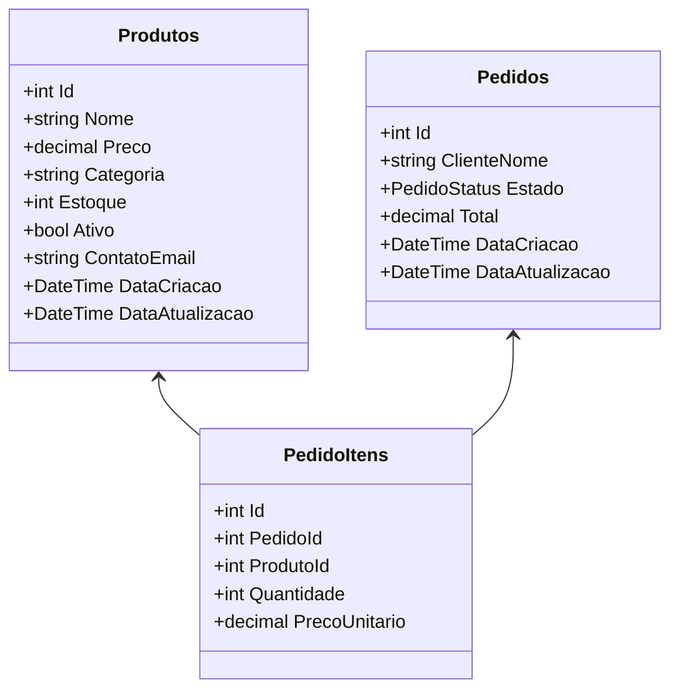

# 🏗️ Arquitetura do Projeto

O repositório demonstra **duas arquiteturas** coexistindo:

1. **Clean Architecture / camadas horizontais** — utilizada para o caso de uso Produtos iniciada na primeira fase.
2. **Vertical Slice Architecture + Domínio Rico** — introduzida na fase 2 para os requisitos de Pedidos.

Ambas compartilham o mesmo pipeline de middleware, `AppDbContext` e dependências registradas em `Program.cs`.

---

## 1. Camadas Horizontais (Produtos)



*src/Endpoints/ProdutoEndpoints.cs | CORS, Logging, Exception Handling | FluentValidation | src/Services/ProdutoService.cs | EF Core | produtos-api.db*

Cada camada tem responsabilidade única e clara: endpoints expõem rotas, validadores checam entrada, serviços orquestram lógica e o contexto de dados conversa com o banco.

### Fluxo de requisição (exemplo PUT /api/v1/produtos/{id})
1. Rota mapeada em `ProdutoEndpoints`.  
2. Validação por `AtualizarProdutoValidator`.  
3. Servidor chama `ProdutoService.AtualizarCompletoProdutoAsync`.  
4. Serviço busca entidade em `AppDbContext`, aplica alterações e chama `SaveChangesAsync`.  
5. Resultado mapeado para DTO e retornado ao cliente.

---

## 2. Vertical Slice (Pedidos)



*src/Features/*/*Endpoint.cs | ex: CreatePedido | src/Features/Pedidos/Domain/ | AppDbContext*

Cada *slice* contém tudo o que ele precisa para satisfazer um caso de uso específico: comando, validação, handler e mapeamento de rota. O handler manipula diretamente o agregado `Pedido`, respeitando invariantes (ex.: somente itens ativos são adicionados, total não excede limite).

Estes slices são descobertos automaticamente durante o startup graças à interface comum `IEndpoint` e reflexão via `AddEndpointsFromAssembly`.

---

## 3. Coexistência das duas abordagens

- Ambos consumen o mesmo `AppDbContext`, tabelas e migrações.
- Serviços de Produtos continuam funcionando ao lado de slices de Pedidos.
- A migração para Vertical Slice foi incremental: as peças existentes de Produtos permaneceram inalteradas.
- Middlewares, autenticação JWT e logging são aplicados globalmente.

---

## Modelo de Dados Unificado



Índices:
- idx_produto_ativo (Produtos)
- idx_produto_categoria (Produtos)

O contexto adiciona `DbSet<Pedido>` e `DbSet<PedidoItem>` quando a fase 2 foi implementada.

---

## Container de Dependências (Program.cs)

- DbContext registrado como Scoped com conexão SQLite.
- Serviços e validadores adicionados (Produtos e Pedidos).
- Scan de IEndpoint para slices.
- Swagger configurado para documentar ambas as APIs.

---

*Esta documentação serve como mapa central das arquiteturas. Consulte o guia conceitual [docs/VERTICAL-SLICE-DOMINIO-RICO.md](./VERTICAL-SLICE-DOMINIO-RICO.md) para detalhes sobre o padrão Vertical Slice.*
```

---

## Request/Response Flow

```mermaid
flowchart TD
    req[HTTP REQUEST<br/>(PUT /api/v1/produtos/1<br/>Body: { "preco":3200 })]
    req --> parse[1. Parse Request (Minimal API)]
    parse --> validate[2. Validate Input<br/>(FluentValidation)]
    validate -- pass --> service[3. Call Service Layer<br/>AtualizarProdutoAsync()]
    validate -- fail --> resp422[Return 422]
    service --> check[4. Check if Product Exists]
    check -- exists --> update[5. Update in Database<br/>(Entity Framework)]
    check -- notexists --> resp404[Return 404]
    update --> map[6. Map to Response DTO<br/>Produto → ProdutoResponse]
    map --> log[7. Log Operation (Serilog)]
    log --> resp200[HTTP RESPONSE<br/>200 OK]
```

---

## Dependency Injection Container

- **DbContext**: `AppDbContext` configurado com conexão SQLite.
- **Services**: `IProdutoService` → `ProdutoService` (Scoped).
- **Validators**: `CriarProdutoValidator`, `AtualizarProdutoValidator`, `LoginValidator`, além dos validadores dos comandos de Pedidos.
- **AutoMapper**: `MappingProfile` (mapeamentos Produto↔DTO, commands etc.).
- **Endpoints**: Scan automático de `IEndpoint` para slices.
- **Outros**: CORS, Swagger, logging e demais middlewares registrados aqui.

---


---

## Project Structure - Detalhado

```
net-minimal-api/
│
├── 📋 DOCUMENTAÇÃO
│   ├── MELHORES-PRATICAS-API.md              [Guia teórico]
│   ├── MELHORES-PRATICAS-MINIMAL-API.md      [Guia prático]
│   ├── README.md                             [Como usar]
│   ├── INICIO-RAPIDO.md                      [Quick start]
│   ├── INDEX.md                              [Índice completo]
│   ├── SUMARIO.md                            [Resumo]
│   ├── CHECKLIST.md                          [Verificação]
│   └── ProdutosAPI.Tests/                     [Exemplos de testes]
│
├── ⚙️ CONFIGURAÇÃO
│   ├── ProdutosAPI.csproj                    [Dependências]
│   ├── Program.cs                            [Setup principal]
│   ├── appsettings.json                      [Config runtime]
│   ├── Properties/launchSettings.json        [Setup execução]
│   ├── .gitignore                            [Git ignore]
│   └── setup.sh                              [Script setup]
│
├── 📦 SRC - Código-Fonte
│   │
│   ├── Models/
│   │   └── Produto.cs                        [Entidade domínio]
│   │
│   ├── DTOs/
│   │   └── ProdutoDTO.cs                     [8 Transfer Objects]
│   │
│   ├── Endpoints/
│   │   └── ProdutoEndpoints.cs               [6 endpoints REST (Produtos)]
│   ├── Features/
│   │   └── Pedidos/                          [5 vertical slices (Pedidos)]
│   │
│   ├── Services/
│   │   └── ProdutoService.cs                 [Lógica negócio]
│   │
│   ├── Data/
│   │   ├── AppDbContext.cs                   [EF Core context]
│   │   ├── DbSeeder.cs                       [Dados teste]
│   │   └── Migrations/
│   │       ├── 20250225000000_CreateInitialSchema.cs
│   │       └── AppDbContextModelSnapshot.cs
│   │
│   ├── Validators/
│   │   └── ProdutoValidator.cs               [3 validadores]
│   │
│   ├── Middleware/
│   │   └── ExceptionHandlingMiddleware.cs    [Error handling]
│   │
│   └── Common/
│       └── MappingProfile.cs                 [AutoMapper config]
│
└── 📁 Pastas Geradas
    ├── bin/                                   [Build output]
    ├── obj/                                   [Build temp]
    ├── logs/                                  [Logs estruturados]
    │   ├── api-YYYYMMDD.txt
    │   └── api-YYYYMMDD.json
    └── produtos-api.db                        [SQLite database]
```

---

## Stack Tecnológico

```
┌───────────────────────────────────────────────────────────┐
│                 .NET 10 LTS                                 │
├───────────────────────────────────────────────────────────┤
│                                                            │
│  ┌─ Web Framework ──────────────────────────────────┐    │
│  │ Minimal API (sem controllers)                    │    │
│  └────────────────────────────────────────────────┘    │
│                                                            │
│  ┌─ ORM ────────────────────────────────────────────┐    │
│  │ Entity Framework Core 9                         │    │
│  │ SQLite provider                                 │    │
│  └────────────────────────────────────────────────┘    │
│                                                            │
│  ┌─ Validation ──────────────────────────────────────┐   │
│  │ FluentValidation                                 │   │
│  └────────────────────────────────────────────────┘    │
│                                                            │
│  ┌─ Mapping ────────────────────────────────────────┐    │
│  │ AutoMapper                                      │    │
│  └────────────────────────────────────────────────┘    │
│                                                            │
│  ┌─ Logging ────────────────────────────────────────┐    │
│  │ Serilog (Console + File sinks)                  │    │
│  │ Structured logging (JSON)                       │    │
│  └────────────────────────────────────────────────┘    │
│                                                            │
│  ┌─ Security ───────────────────────────────────────┐    │
│  │ JWT Bearer Authentication (ready)               │    │
│  │ CORS configured                                 │    │
│  │ Input validation & sanitization                 │    │
│  └────────────────────────────────────────────────┘    │
│                                                            │
│  ┌─ Documentation ──────────────────────────────────┐    │
│  │ Swagger/OpenAPI                                 │    │
│  │ SwaggerUI                                       │    │
│  │ XML comments                                    │    │
│  └────────────────────────────────────────────────┘    │
│                                                            │
│  ┌─ Performance ────────────────────────────────────┐    │
│  │ Async/Await throughout                          │    │
│  │ Query optimization                              │    │
│  │ Pagination (built-in)                           │    │
│  └────────────────────────────────────────────────┘    │
│                                                            │
└───────────────────────────────────────────────────────────┘
```

---

## Data Model

```
┌─────────────────────────────────────────┐
│          Tabela: Produtos               │
├─────────────────────────────────────────┤
│ Coluna              │ Tipo      │ Rules │
├─────────────────────┼───────────┼───────┤
│ Id (PK)             │ INTEGER   │ Auto  │
│ Nome                │ TEXT(100) │ NOT N │
│ Descricao           │ TEXT(500) │ NOT N │
│ Preco               │ DECIMAL   │ > 0   │
│ Categoria           │ TEXT(50)  │ List  │
│ Estoque             │ INTEGER   │ >= 0  │
│ Ativo               │ BOOLEAN   │ Deft: │
│ ContatoEmail        │ TEXT(100) │ Email │
│ DataCriacao         │ DATETIME  │ UTC   │
│ DataAtualizacao     │ DATETIME  │ UTC   │
├─────────────────────────────────────────┤
│ Índices                                 │
├─────────────────────────────────────────┤
│ idx_produto_ativo (Ativo)               │
│ idx_produto_categoria (Categoria)       │
└─────────────────────────────────────────┘
```

---

## Endpoints Overview

```
┌─────────────────────────────────────────────────────────────┐
│                    REST Endpoints                           │
├─────────────────────────────────────────────────────────────┤
│                                                              │
│ GET    /api/v1/produtos                                    │
│        ├─ Paginação: page=1, pageSize=20                   │
│        ├─ Filtro: categoria="Eletrônicos"                  │
│        ├─ Busca: search="notebook"                         │
│        └─ Response: PaginatedResponse<ProdutoResponse>     │
│                                                              │
│ GET    /api/v1/produtos/{id}                               │
│        ├─ Retorna: ProdutoResponse                         │
│        └─ Error: 404 se não encontrado                     │
│                                                              │
│ POST   /api/v1/produtos                                    │
│        ├─ Body: CriarProdutoRequest                        │
│        ├─ Retorna: ProdutoResponse (201 Created)           │
│        └─ Error: 422 se validação falhar                   │
│                                                              │
│ PUT    /api/v1/produtos/{id}                               │
│        ├─ Body: CriarProdutoRequest (completo)             │
│        ├─ Retorna: ProdutoResponse                         │
│        └─ Error: 404 ou 422                                │
│                                                              │
│ PATCH  /api/v1/produtos/{id}                               │
│        ├─ Body: AtualizarProdutoRequest (parcial)          │
│        ├─ Retorna: ProdutoResponse                         │
│        └─ Error: 404 ou 422                                │
│                                                              │
│ DELETE /api/v1/produtos/{id}                               │
│        ├─ Soft delete (Ativo = false)                      │
│        ├─ Retorna: 204 No Content                          │
│        └─ Error: 404 se não encontrado                     │
│                                                              │
│ GET    /health                                              │
│        └─ Retorna: { "status": "healthy" }                 │
│                                                              │
└─────────────────────────────────────────────────────────────┘
```

---

## Error Handling Flow

```
Request
  │
  ├─→ Validation Failed
  │   └─→ ValidationException
  │       └─→ 422 Unprocessable Entity
  │           {
  │             "errors": {
  │               "campo": ["mensagem erro"]
  │             }
  │           }
  │
  ├─→ Resource Not Found
  │   └─→ KeyNotFoundException
  │       └─→ 404 Not Found
  │
  ├─→ Invalid Arguments
  │   └─→ ArgumentException
  │       └─→ 400 Bad Request
  │
  ├─→ Unauthorized Access
  │   └─→ UnauthorizedAccessException
  │       └─→ 401 Unauthorized
  │
  └─→ Unexpected Error
      └─→ Generic Exception
          └─→ 500 Internal Server Error
              (Sem stack trace em production)
```

---

**Versão**: 1.0.0  
**Data**: 25 de Fevereiro de 2025  
**Framework**: .NET 10 LTS  
**Pattern**: Minimal API + REST + Clean Architecture
